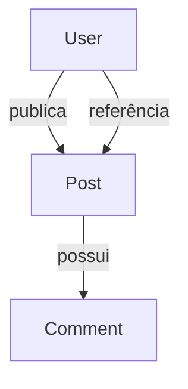

# 🖤 API de Postagens com MongoDB

Uma API REST desenvolvida com **Spring Boot** e **MongoDB**, seguindo uma arquitetura limpa, organizada e escalável. O projeto simula uma pequena rede social onde usuários podem criar posts e adicionar comentários, utilizando documentos aninhados do MongoDB e referências entre coleções.

---

## 🧭 **Visão Geral do Projeto**

Esta aplicação demonstra:

* CRUD completo de **Usuários**
* Associação entre **Usuários → Posts → Comentários**
* Uso de **MongoRepository**, consultas customizadas e DTOs
* Padrões de projeto comuns em APIs Java com Spring
* Seed automático de dados iniciais ao iniciar o sistema

---

## 🏗️ **Arquitetura da Aplicação**



---

## 🔥 **Tecnologias Utilizadas**

* **Java 17+**
* **Spring Boot 3**
* **MongoDB**
* Spring Web
* Spring Data MongoDB

---

## 📁 **Estrutura do Projeto**

```
src/main/java/org.projetos.workshopmongo
│
├── domain
│   ├── User.java
│   ├── Post.java
│   └── ...
│
├── dto
│   ├── UserDTO.java
│   ├── AuthorDTO.java
│   └── CommetDTO.java
│
├── repository
│   ├── UserRepository.java
│   └── PostRepository.java
│
├── service
│   ├── UserService.java
│   └── PostService.java
│
└── exceptions
```

---

## 🚀 **Como Executar o Projeto**

### 1. Suba o servidor do MongoDB

```
docker run -d -p 27017:27017 --name mongo mongo
```

### 2. Execute a aplicação

```
mvn spring-boot:run
```

Ao iniciar, o sistema cria automaticamente:

* Usuários
* Posts
* Comentários

---

## 🌐 **Endpoints Principais**

### 🔹 **Usuários**

| Método | Endpoint      | Descrição               |
| ------ | ------------- | ----------------------- |
| GET    | `/users`      | Lista todos os usuários |
| GET    | `/users/{id}` | Busca usuário por ID    |
| POST   | `/users`      | Cria um novo usuário    |
| PUT    | `/users/{id}` | Atualiza usuário        |
| DELETE | `/users/{id}` | Remove usuário          |

### 🔹 **Posts**

| Método | Endpoint                   | Descrição                  |
| ------ | -------------------------- | -------------------------- |
| GET    | `/posts/{id}`              | Busca um post por ID       |
| GET    | `/posts/titlesearch?text=` | Pesquisa posts pelo título |

---

## 🧩 **Modelos (Domain)**

### **User**

* id
* name
* email
* posts (referência via `@DBRef`)

### **Post**

* id
* date
* title
* body
* author (DTO)
* comments (lista de CommetDTO)

### **CommetDTO**

* texto
* date
* author

---

## 🗂️ **Funcionamento dos Comentários**

Os **comentários** são armazenados diretamente dentro do documento Post, utilizando a força do MongoDB para trabalhar com documentos aninhados.

Fluxo:

1. Usuário publica um post
2. Outro usuário adiciona um comentário
3. O comentário é salvo dentro do próprio documento do post

---

## 🛠️ **Consulta Customizada no MongoDB**

Exemplo de busca por título ignorando maiúsculas/minúsculas:

```java
@Query("{'title': {$regex: ?0, $options: 'i'}}")
List<Post> searchByTitle(String title);
```

---

## 🧪 **Seed Automático de Dados**

Na classe `Instantiation`, ao iniciar o projeto são criados:

* Maria, Alex e Bob
* Posts com datas formatadas
* Comentários anexados aos posts

---

## 🖤 **Estilo e Visual Dark Premium**

Este README segue um layout escuro, elegante e moderno, ideal para portfólios profissionais.

---

---

